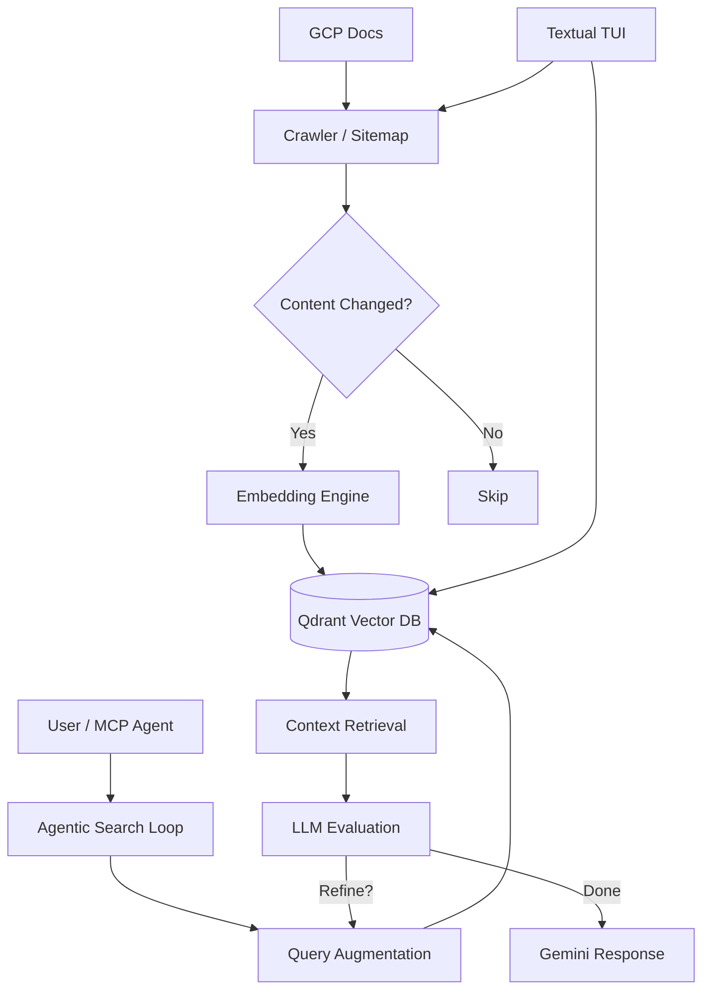

# qdoc 🔍 🚀

**qdoc** is an advanced Retrieval-Augmented Generation (RAG) tool designed specifically for Google Cloud Platform (GCP) documentation. It combines high-performance crawling, vector search, and Gemini's reasoning capabilities to provide precise answers, all accessible via a sleek terminal interface or as an MCP server for your favorite AI assistants.

[](https://www.python.org/downloads/)
[](https://opensource.org/licenses/MIT)
[](https://deepmind.google/technologies/gemini/)

## ✨ Key Features

*   **🕵️ Intelligent Discovery**: Uses Gemini to discover relevant documentation URLs based on high-level topics or search queries.
*   **🧩 Navigation Extraction**: High-performance extraction of sidebar navigation structures from complex documentation sites.
*   **🕷️ Robust Crawler**: Recursive and sitemap-based crawling with parallel batch ingestion, content-hash deduplication, and domain filtering.
*   **🧠 Agentic Search**: An advanced MCP tool that performs iterative vector search, evaluates results, and refines queries automatically to find the best possible answer.
*   **🖥️ Textual TUI**: A beautiful, interactive dashboard for exploring ingested documents, monitoring ingestion logs, and querying the knowledge base.
*   **🔗 MCP Server**: Exposes its intelligence as a Model Context Protocol (MCP) server, allowing Claude and other MCP-compatible agents to "know" GCP docs as well as you do.
*   **⚡ Modern Stack**: Built with `uv`, `crawl4ai`, `Qdrant`, `Vertex AI (text-embedding-004)`, and `Gemini 2.0 Flash`.

---

## 🏗️ Architecture



---

## 🚀 Quick Start

### 1. Prerequisites

*   Python 3.13+
*   [uv](https://github.com/astral-sh/uv) installed.
*   Google Cloud Project with Vertex AI enabled.
*   A running [Qdrant](https://qdrant.tech/) instance (via Docker).

### 2. Setup

```bash
# Clone the repository
git clone https://github.com/geraldofigueiredo/qdoc.git
cd qdoc

# Start Qdrant
make up

# Login to Google Cloud
gcloud auth application-default login

# Install dependencies
make install
```

### 3. Usage

**Ingest documentation:**
```bash
make ingest URL=https://cloud.google.com/vertex-ai/docs DEPTH=3
```

**Launch the Interactive TUI:**
```bash
make tui
```

**Query via CLI:**
```bash
make query Q="How to use Gemini on Vertex AI?"
```

---

## 🤖 MCP Server Integration

To use **qdoc** as an MCP tool in Claude Desktop, add the following to your configuration:

```json
{
  "mcpServers": {
    "qdoc": {
      "command": "qdoc",
      "args": ["serve"]
    }
  }
}
```

This provides the `search_gcp_docs` tool, which uses an agentic retry loop to ensure high-quality context retrieval.

---

## 🛠️ Technology Stack

*   **Language**: Python 3.13
*   **Orchestration**: [uv](https://github.com/astral-sh/uv)
*   **Crawler**: [crawl4ai](https://github.com/unclecode/crawl4ai)
*   **Vector Database**: [Qdrant](https://qdrant.tech/)
*   **Embeddings**: Google Vertex AI `text-embedding-004`
*   **LLM**: Gemini 2.0 Flash
*   **UI**: [Textual](https://textual.textualize.io/)
*   **Interface**: [Model Context Protocol (MCP)](https://modelcontextprotocol.io/)

---

## 📜 License

This project is licensed under the MIT License - see the [LICENSE](LICENSE) file for details.


